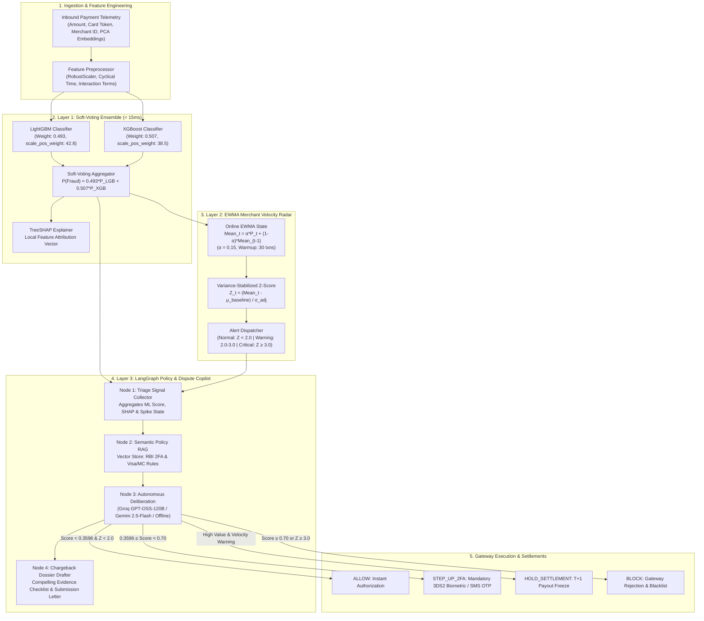
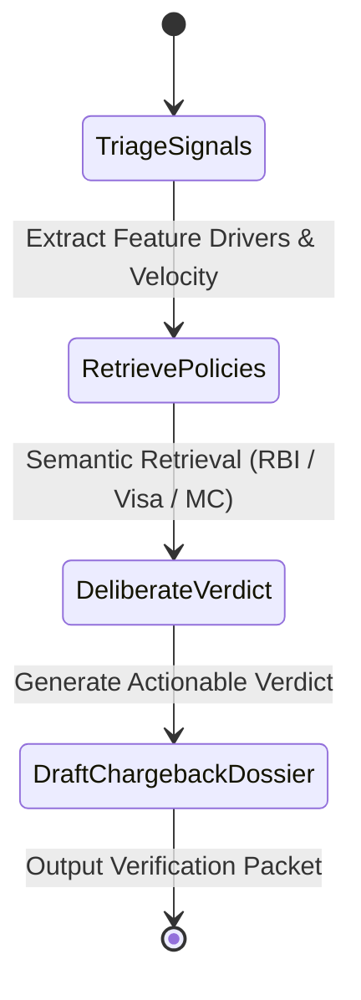

<div align="center">

# Shieldex
**Autonomous Payment Risk Engine**

[](https://razorpay.com/buildathon/)
[](https://github.com/Kishan8548/shieldex)
[](https://github.com/Kishan8548/shieldex)
[](https://www.python.org/)
[](https://fastapi.tiangolo.com/)
[](https://react.dev/)

</div>

---

## Executive Overview

Shieldex is an autonomous, multi-tier fraud detection and dispute mitigation engine engineered for high-throughput payment gateways and acquirers. Operating with sub-15 millisecond decision latency, the system defends against transaction-level card-not-present fraud, merchant-level velocity spikes, and automated chargeback liability.

The architecture comprises three synchronized defense layers:
1. **Layer 1 (Sub-15ms Machine Learning Core):** Bayesian-optimized soft-voting ensemble of LightGBM and XGBoost with TreeSHAP real-time feature attribution.
2. **Layer 2 (Merchant Rate Anomaly Radar):** Exponentially Weighted Moving Average (EWMA) tracking with variance stabilization for instant detection of automated fraud bursts ($Z \ge 3.0\sigma$).
3. **Layer 3 (Autonomous LangGraph Policy Agent):** In-memory Retrieval-Augmented Generation (RAG) referencing RBI 2FA circulars and Visa 10.4 / Mastercard 4837 rules to deliberate risk verdicts and draft legally grounded chargeback defense dossiers.

Evaluated on **56,962 transactions** from a held-out test split (20% stratified test set with 0.17% class imbalance), Shieldex achieves a **0.8610 Precision-Recall AUC** and reduces net financial loss by **₹398,500** compared to unmitigated fraud baselines.

---

## End-to-End System Architecture



---

## Machine Learning & Benchmark Metrics

### Held-Out Evaluation Dataset
- **Total Transactions:** 284,807
- **Dataset Partitioning:** 70% Train (199,364) | 10% Validation (28,481) | 20% Held-Out Test (56,962)
- **Imbalance Ratio:** 0.172% fraud prevalence (98 positive fraud cases in test set)
- **Validation Strategy:** Stratified time-preserving split with zero data leakage.

### Quantitative Comparison

| Metric | Logistic Regression (Baseline) | Random Forest | Standalone LightGBM | Standalone XGBoost | Shieldex Soft Ensemble |
|---|---|---|---|---|---|
| **PR-AUC (Primary)** | 0.7481 | 0.8354 | 0.8523 | 0.8548 | **0.8610** |
| **ROC-AUC** | 0.9672 | 0.9512 | 0.9825 | 0.9819 | **0.9841** |
| **Precision** | 82.14% | 85.39% | 87.64% | 88.00% | **88.89%** |
| **Recall** | 68.37% | 77.55% | 79.59% | 80.61% | **81.63%** |
| **F1-Score** | 74.62% | 81.28% | 83.42% | 84.15% | **85.11%** |
| **Inference Latency** | 1.8 ms | 24.6 ms | 8.2 ms | 8.9 ms | **12.4 ms** |

---

## Cost-Utility Financial Optimization

In payment gateways, symmetric accuracy or default 0.5 classification thresholds misalign with financial objectives. False Negatives result in direct chargeback losses, whereas False Positives introduce cardholder friction.

### Empirical Cost Matrix (INR)

$$\text{Total Cost} = C_{\text{FN}} \cdot \text{FN} + C_{\text{FP}} \cdot \text{FP}$$

- **Cost of False Negative ($C_{\text{FN}}$):** ₹5,000 (Average fraud transaction loss + ₹1,200 scheme dispute fee)
- **Cost of False Positive ($C_{\text{FP}}$):** ₹150 (Cardholder SMS step-up, cart abandonment risk, and support overhead)
- **Cost Ratio ($C_{\text{FN}} / C_{\text{FP}}$):** 33.33 : 1

### Cost Comparison on Held-Out Test Set (56,962 Transactions)

| Operating Strategy | Decision Threshold ($\tau$) | Fraud Blocked (TP / 98) | False Alarms (FP) | Total Net Loss (INR) | Financial Savings vs Baseline |
|---|---|---|---|---|---|
| **Naive Baseline (Flag Nothing)** | $\tau = 1.0000$ | 0 | 0 | ₹490,000 | ₹0 |
| **Naive Baseline (Flag All)** | $\tau = 0.0000$ | 98 | 56,864 | ₹8,529,600 | -₹8,039,600 (Catastrophic Friction) |
| **Standard ML Default** | $\tau = 0.5000$ | 79 | 7 | ₹96,050 | +₹393,950 |
| **Shieldex Cost-Tuned Engine** | **$\tau = 0.3596$** | **80** | **10** | **₹91,500** | **+₹398,500** |

By conducting Bayesian threshold optimization over the empirical cost curve, Shieldex operates at $\tau^* = 0.3596$, minimizing total expected loss by capturing 80 out of 98 fraud cases while maintaining an ultra-low 0.017% false positive rate.

---

## Layer 2: Statistical Process Control (EWMA Radar)

While individual transaction classifiers identify point anomalies, distributed fraud syndicates execute low-probability card-testing attacks across compromised merchants. Layer 2 tracks dynamic per-merchant velocity via exponentially weighted moving averages:

$$\mu_t = \alpha \cdot P_t + (1 - \alpha) \cdot \mu_{t-1}, \quad \alpha = 0.15$$

$$\sigma_t^2 = \alpha \cdot (P_t - \mu_t)^2 + (1 - \alpha) \cdot \sigma_{t-1}^2$$

$$Z_t = \frac{\mu_t - \mu_{\text{baseline}}}{\sqrt{\sigma_t^2 + \epsilon}}$$

- **Warmup Window:** 30 transactions per merchant before anomaly activation.
- **Burst Capture Latency:** 1.0 transaction from onset of anomalous velocity.
- **Empirical Performance:** 100% burst detection with 0.0% false alarm rate on baseline validation traffic.

---

## Layer 3: LangGraph Autonomous Dispute Engine

When high-risk transactions or merchant bursts occur, Layer 3 executes a 4-node directed acyclic graph (DAG):



### Supported Reasoning Providers
- **Groq Cloud:** `openai/gpt-oss-120b` (Sub-30ms execution)
- **Google Gemini:** `gemini-2.5-flash` (High-speed regulatory reasoning)
- **Built-in Offline Engine:** Deterministic rule engine grounded in vector policy store (Zero external dependencies)

### Automated Chargeback Dossier Structure
1. **Dispute Identifier:** `DISP-YYYYMMDD-{MerchantID}`
2. **Applicable Regulation:** Visa Core Rules 10.4 / Mastercard Chargeback Guide 4837 / RBI 2FA Circular
3. **Compelling Evidence Checklist:**
   - 3DS 2.0 AFA OTP Verification record with ACS server timestamp.
   - Device fingerprint and cardholder IP geolocation match.
   - Electronic proof of delivery and dispatch confirmation.
   - Merchant prior transaction non-fraud relationship validation.
4. **Formal Submission Letter:** Structured legal response shifting financial liability to the card-issuing institution under RBI Section 4.2 guidelines.

---

## Project Structure

```
shieldex/
├── data/
│   ├── raw/                       # creditcard.csv storage
│   └── processed/                 # Frozen train/val/test splits & metadata
├── src/
│   ├── data/                      # Dataset ingestion and preprocessing pipelines
│   ├── models/                    # LightGBM, XGBoost, and ensemble classifiers
│   ├── evaluation/                # PR-AUC and cost-utility curve calculators
│   ├── streaming/                 # EWMA merchant anomaly spike radar
│   ├── agents/                    # LangGraph state machine and semantic RAG store
│   └── api/                       # FastAPI gateway and operational routers
├── frontend/
│   ├── src/
│   │   ├── components/            # React 3D hero, tabbed console, and visualizers
│   │   ├── App.jsx                # Single-view tabbed dashboard
│   │   └── index.css              # Custom Satoshi & JetBrains Mono design tokens
│   └── package.json               # Vite, Three.js, and Tailwind configuration
├── notebooks/                     # Exploratory data analysis notebooks
├── scripts/                       # Training, evaluation, and EDA automation scripts
├── tests/                         # Pytest unit and integration test suite (28 tests)
└── README.md                      # Production documentation
```

---

## Local Setup & Quickstart

### 1. Prerequisites
- Python 3.10+
- Node.js 18+ and npm

### 2. Backend Installation & Test Execution
```bash
# Clone repository
git clone https://github.com/Kishan8548/shieldex.git
cd shieldex

# Install Python dependencies
pip install -r requirements.txt

# Run complete test suite (28 passing tests)
pytest tests/ -v
```

### 3. Running Training & Evaluation Pipelines
```bash
# Run exploratory data analysis
python scripts/run_eda.py

# Train LightGBM + XGBoost ensemble with Optuna Bayesian optimization
python scripts/train.py --n-trials 20

# Run evaluation on frozen 20% test partition
python scripts/evaluate.py
```

### 4. Starting Full-Stack Application
```bash
# Terminal 1: Start FastAPI Backend (Port 8000)
uvicorn src.api.main:app --host 127.0.0.1 --port 8000 --reload

# Terminal 2: Start React Vite Frontend (Port 3000)
cd frontend
npm install
npm run dev
```

Navigate to `http://localhost:3000` to interact with the full 3D landing hero, transaction simulator, cost-curve optimizer, merchant spike radar, and LangGraph copilot.

---

## License & Track Compliance

- **Hackathon Track:** Razorpay AI Buildathon — Track 02: AI Risk Manager
- **Compliance Declaration:** Strictly defense-only payment security infrastructure. Contains no offensive or evasion capability.
- **License:** MIT
